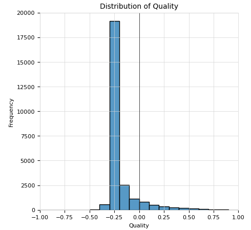
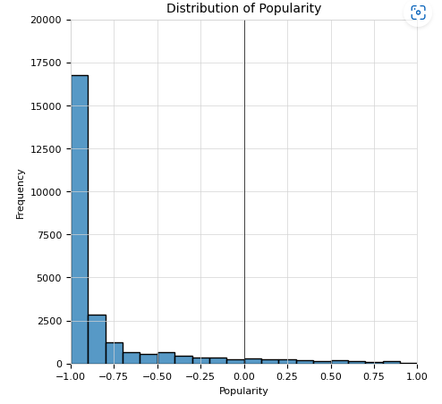
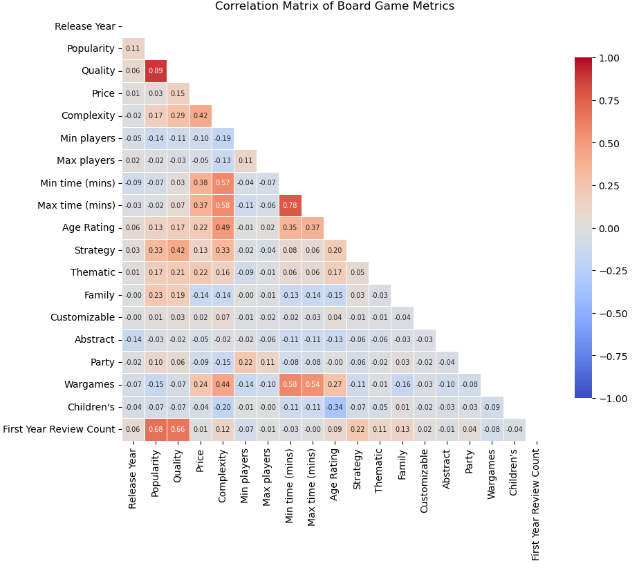
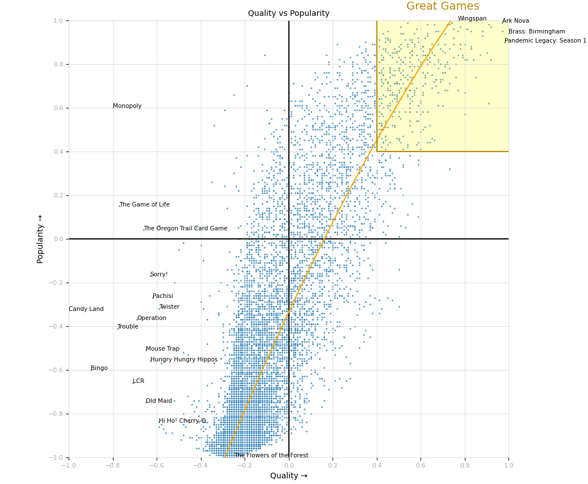
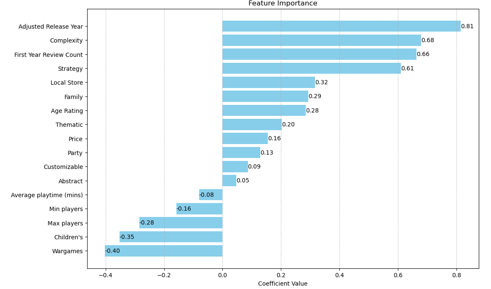
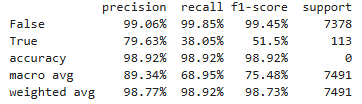
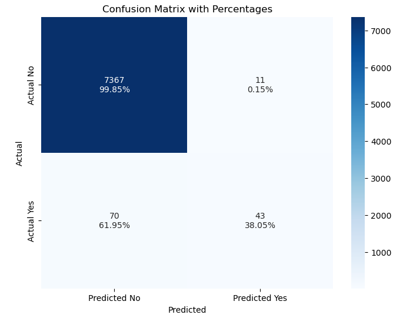

# Executive Summary

I used a statistical classification model to understand what makes a game popular for a sustained period and consistently receive good reviews. These standout games can be flagged as “Great Games”.

## Key Insights

The below graph shows how a games perceived quality is distributed:

This one shows how popularity is distributed:

We can see that it is very difficult for a game to break away from the norm.

The Correlation Matrix shows which game features are correlated with one another:

- **Complexity** has a relationship with several variables so could be a strong statistical contender.
- The strong link between **Popularity** and **Quality** is reassuring. Good games are more popular etc.
- We could consider removing Release Year, Min players and Max players from the statistical model due to the lack of relationship between variables.
- **Wargames** are more complex and take longer to play.
- **Strategy** games are more popular and of better quality.

The below scatterplot places every board game on an axis of Popularity vs Quality. The best of the best games have been highlighted with a yellow square:

The graph shows the trend of increased quality results in higher popularity.

- **Top Left** - High Popularity, Low Quality - Timeless Classics
- **Top Right** - High Popularity, High Quality - Good Games
- **Bottom Left** - Low Popularity, Low Quality - Starting out/Flop
- **Bottom Right** - Low Popularity, High Quality - Hidden Gems/Niche**

### Standout Features:

The model identified several key game features that matter.

- **Complexity** – Games that are more complex tend to have better long-term engagement and higher ratings.
- **Release Year** – More recently published games tend to score higher while very old classic games tend to score lower.
- **Player Count** – Games which cater for more players struggle to reach high long-term engagement.

### Genre Analysis:
- **Strategy games** have the strongest impact on becoming a great game.
- **Classic Wargames** struggle to battle against modern strategy games.

This means the hobbyist-heavy (strategic and complex) up-to-date games have better odds of being well regarded by the community.

## The Model

When tested, the model correctly classified 98.9% of predictions.
- The model is very accurate at predicting if a game will not achieve “Great Game” status, 99.9%.
- However, it struggles more when predicting if a game will be great, predicting 38.0% of “Great Games”.

## Error Handling

- **Type I Error** - In 0.1% of cases, the model predicted a game would achieve greatness, when in fact, it did not.
- **Type II Error** - In 62.0% of cases, the model predicted the game would not achieve greatness when, in fact, it did. (Bhandari, 2021)

This is better for game developers where the model is unlikely to give false hope that a game will perform well. However, it may come across as overly critical of games that will perform well.

## Real World Impact

The analysis suggests stocking games with these characteristics—newer, complex strategy games—are more likely to align with what the players consider to be “Great Games”. The insights are not perfect predictions but do provide actionable guidance on which attributes drive positive ratings in the Board Game Geek (BGG) community.
